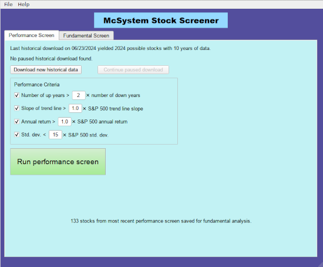

## McScreener Stock Screener
*A stock screener that focuses on long term performance and fundamental analysis*

### Contents
1. [Introduction](#introduction)
2. [Installation](#installation)
3. [Usage](#usage)
4. [Conclusion](#conclusion)

### Introduction

For over 20 years I have been using a system to pick stocks based on their long term price performance and fundamental financial data.  Over the years, this system has generated very satisfying results.  Below is a chart showing the actual net asset value (NAV) of a collection of stocks chosen using this system:  

It's generally hard to beat the Standard & Poor's 500 index return with any system. But this system's total return over 20 years is almost a factor of 13, while the S&P 500 index increased by only a factor of 4 over the same period.

The basic philosophy of this system is that while the stock market is generally more or less a random walk, there are companies out there that are simply great companies, with good products and good management.  Such companies on average grow steadily over a time, regardless of the daily up/down noise of the market. They don't rocket up and then crash, but rather just keep on inching up year after year.  In operating their business, they take reasonable risks, but do not overextend themselves with high debt.  Importantly, for whatever reason, they haven't been widely identified by other investors to the point where their stock price has already become inflated.

This philosophy is not rocket science, and has been embraced by the likes of Warren Buffet or [The American Association of Individual Investors](https://www.aaii.org).  The trick of course is in finding stocks that match these criteria among the 4000+ companies out there.  That's where this software comes in.

There is a lot of data out there on the internet.  This software begins by downloading several (like 10) years of monthly historical price data from [finance.yahoo.com](https://finance.yahoo.com) for *all* the stocks listed on the New York Stock Exchange and the NASDAQ (that have that much data).  This usually results in about 1500 stocks. It also takes several hours, but fortunately it only needs to be done every 6 months or so, because we are looking for multi-year trends.  Then a screen is done based on several measures of steady growth in stock price over this time period.  These measures can be turned on or off, and their parameters can be adjusted.  It's quite possible to eliminate all stocks at this step, but the idea is to tweak the parameters until about 100 to 200 stocks remain.

The screening process then turns to fundamental analysis.  Whether the price is reasonable is judged by the price to earnings ratio and the price to book ratio.  Whether the business is fundamentally a good one is judged by the profit margin, the 5-year earnings-per-share growth, and the 5-year sales growth (again, looking for long term trends).  Debt, measured by the current ratio and the debt-to-equity ratio, is used to judge how the company manages risk: some debt is good, to leverage growth, but too much is risky.    

### Installation
The program is written in Python 3 and developed under Linux.  It should also run under Windows and MacOS, but has not been tested much. Fonts may be a little strange. The best way to install is to clone the repository (e.g., download the .zip file and extract in a suitable location).  Then [create a virtual environment](https://realpython.com/intro-to-pyenv/), and type 

`pip install -r requirements.txt` 

Then to run the program, type

`python McScreener.py`  

Alternatively you can skip the virtual environment and, after downloading, extracting to a folder and `cd`-ing to the folder, type

 `pip install -r requirements.txt --user`  
 
 As before, running is done by typing `python McScreener.py`.  You may need to use `pip3` and `python3` instead, depending on your system. 
  
### Usage
The first thing you need to do is download historical price data for as many stocks as possible.  Click on the Performance Screen tab and then press "Download new historical data".  The program then downloads a list of ticker symbols of all stocks in the NYSE and the NASDAQ. The ticker list is obtained from www.nasdaqtrader.com. Only domestic stocks that are not "test issues" or ETFs are kept.  A window then opens offering you the opportunity to download the historical price data.  Enter the desired number of years (default 10) and press "Yes".  Downloading this data for several thousand stocks take a while.  The process is also slowed down on purpose to avoid being blocked as a possible robot. This only needs to be done every 6 months or so. At any time you can cancel the download or pause it and pick it up later if desired.

#### Performance screen
Once you've downloaded all the data you then screen it for performance over the period you've downloaded (e.g., 10 years).

Four criteria are offered, each of which can be toggled on or off independently:

- The number of years in which the stock price finished higher on December 31 than on January 1 (number of "up" years) should be larger than the number of "down" years.  You can choose the multiple; the default is 2.

- The slope of a line fit to the log of the price over the entire date range should be larger than a similar line fit to the S&P 500 index.  A choice for the multiple is offered, with the default being 1.0.  

-  The annual return (i.e. annualized percentage increase of the stock price over the entire period) should be larger than the annual return of the S&P 500 index.  A choice for the multiple is offered as well, with default 1.0.

- The standard deviation of the log of stock price relative to the straight line fit to it should be less than a selectable multiple of the same measure for the S&P 500 index. This screens for stocks that don't fluctuate and just have steady upward moment.  However, individual stocks tend to fluctuate much more than the S&P average, so this multiple needs to be around 15 to avoid screening out too many stocks.

The performance screen can be run as many times as you like on the downloaded data, experimenting with different criteria. In the end you should have selected a couple hundred stocks to proceed to fundamental screening.

#### Fundamental screen

Click on the Fundamental Screen tab to apply fundamental criteria to the performance-screened stocks.  If a performance screen has recently been performed, a new set of fundamental data needs to be downloaded.  Click on "Download new fundamental data" and data will be scraped from the website [finviz.com](https://www.finviz.com).  

The following criteria are available for fundamental screening using minimum and maximum values, with suggested defaults.  

- Price to earnings (P/E) ratio
- Price to book (P/B) ratio
- Earnings per share (EPS) growth over 5 years
- Sales growth over 5 years
- Current ratio
- Debt to equity ratio
- Price 

Each criterion can also be given a relative weight.  The absolute value of the weight doesn't matter, only its value relative to the other weights.  For more information on the meaning of these criteria and how they can be used, see, for example, [investopedia.com](https://www.investopiedia.com).

When the fundamental screen is run, each stock is given a score according to whether the criteria are met.  A score of 100 means all criteria are met.  You can choose a score cut-off (default 80), below which stocks are rejected.  Depending on the criteria, the results can sometimes be dominated by banks, because of the way they are valuated relative to other stocks. In this case it can be useful to check "reject banks" to avoid this. After running a fundamental screen, click on "Open result in spreadsheet" to view the selected stocks.  Note you will need to have a spreadsheet program like Excel or LibreOffice Calc installed and set as the default spreadsheet opener. Typically you will want to have a dozen or more to choose from and do further research on. 

#### Selling

This program can suggest stocks to buy, but it does not address the question of when or if to sell a stock.  Generally, the best approach is "buy and hold": just keep adding to your portfolio and never sell anything.  Well, that's almost true, but there are actually times when it is no longer a good idea to hold on to a stock.  My approach is to apply the same fundamental criteria used for selection, perhaps with somewhat less stringent criteria, to all stocks being held.  The idea is to ask yourself, would I buy this stock today?  You want to ask, what's the prospect going forward from now? I also don't do anything for at least 3 years after purchasing a stock, just to ensure that any negative trends observed are not just fluctuations.  The program currently doesn't provide this screening, but it's still probably a good idea to check the fundamental data of any stock you own every quarter or so.  If things look bad, you should consider selling and trying a new stock.      

### Conclusion

This screening program delivers a list of possible stock purchases.  Of course good investing involves more that just looking at these numbers.  It is important to do research on any company suggested by this system before making an actual purchase.

One of the drawbacks of this screening procedure is that the results tend to be pretty static.  The 10-year historical data and the fundamental data don't change much from day to day.  Unless you change your screening criteria dramatically, pretty much the same list of stocks are selected each time you run the screens.  Also, as with any hard-cut-off screening method, it's always possible that a really good stock with a value just a little bit over the cut off will be missed.  And, of course there is the old standard caveat that past performance is no guarantee of future results. Even companies that do very well over ten years or more can face new challenges in a changing business landscape, making them less attractive for investing.

I hope you find this useful or at least informative.  Of course I make no claim that anyone else's use of this software will lead to their making money in the stock market.  Good luck if you decide to try it!
 

